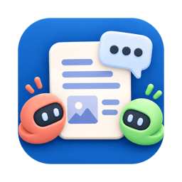

# SNZ Studio

> 日本語: [README.ja.md](README.ja.md)

A minimal local-LLM project workspace for personal use.
It offers an experience close to ChatGPT / Claude Projects, built out of nothing more than
**Wails v2 (Go core + OS-native WebView) + a React/Vite frontend + SQLite + the local
filesystem** — a standalone desktop app you install and launch.

## Features

- Create, list and view projects
- Per-project `documents`, `chats` and `memories`
- Register `markdown` / `text` / `image` documents
- Automatic document-category inference, with manual override
- SQLite FTS-based document / memory search
- Per-chat summary storage
- A minimal persistent-memory implementation
- Per-assistant-reply display of which `project` / `summary` / `document` / `memory` was referenced
- Multi-agent chats (chats where two or more participants speak in turn)
  - Per-participant display name, role prompt, endpoint and model (splitting endpoints lets you
    mix several LM Studio instances)
  - Turn rules: cycling the roster (`round_robin`), nominating the next speaker (`manual`), a
    chosen facilitator speaking every other turn (`facilitator_alternating`, for a game master), or
    letting whoever was called on — or has been quiet longest — speak next (`weighted`)
  - A scene prompt (topic, setting, world) shared by every participant
  - For tabletop RPGs: state sheets (place, HP, inventory) every participant reads, and `/roll`
    dice the app rolls and checks against a target when a participant or you write the command, and
    `/add`, `/use` and `/set` effect commands the app applies to the state sheets (nothing is used
    that the sheet shows none of; each command is described in `docs/multi-agent-commands.md`)
  - 25 bundled presets (debate, improv theatre, a TRPG table and others) to start from, plus
    your own presets loaded from JSON files (format: `docs/multi-agent-presets.md`)
  - A spectator view that advances one turn at a time or runs automatically, and lets you speak
    into the conversation as a human at any point
- Connects to OpenAI-compatible APIs
  - LM Studio
  - Ollama's OpenAI-compatible endpoint
  - Other compatible servers

## Installation

Download the installer for your OS from the
[Releases](https://github.com/serendipitynz/snz_studio/releases) page. `SHA256SUMS.txt` beside them
lists their checksums.

- macOS: `SNZ-Studio-<version>-macOS.dmg` (universal). It is signed with a Developer ID and
  notarized, so it opens without a Gatekeeper warning. Drag the app onto the Applications folder.
  The bundled embedding sidecar is arm64 only, so on an Intel Mac built-in embedding does not
  start; point embeddings at an external endpoint instead (see "LLM connection").
- Windows: `SNZ-Studio-<version>-Windows-amd64-installer.exe`. It installs for the current user into
  `%LOCALAPPDATA%\Programs\SNZ Studio`, without asking for administrator approval. It is not
  code-signed, so SmartScreen warns on first launch ("More info" → "Run anyway"). The installer
  fetches the WebView2 runtime when it is missing.

An LLM endpoint (LM Studio, Ollama or another OpenAI-compatible server) is still needed; see
"LLM connection".

## Updates

The app updates itself from the [Releases](https://github.com/serendipitynz/snz_studio/releases)
page.

- About five seconds after launch, the app asks GitHub once whether a newer version has been
  published. When there is one, a dialog shows its version number; nothing is downloaded until you
  choose "Update". When GitHub cannot be reached, nothing is shown. This check is the only time the
  app connects to the internet without being asked to.
- To turn the check off, open Settings and clear "Check for a new version at startup" under
  "Updates". The same section shows the running version and has "Check now" for checking by hand.
- After you choose "Update", the app downloads the new version, checks its signature against the
  public key built into the app, and replaces itself only when the check passes. It then quits and
  starts again as the new version. When any step fails, the dialog says the update was not made, and
  the installed version stays as it was.
- macOS replaces the `.app` where it is installed. When it cannot — the app is running from the
  disk image or from where it was downloaded, or your account cannot write to the folder holding it
  — the dialog points you to the Releases page instead. Keep the app in the Applications folder.
- Windows runs the new version's installer, which replaces the copy installed for the current user.
- The system may ask for your password or an administrator's approval during an update. On
  Windows, neither installing nor updating asked for administrator approval in testing.

### Moving from v0.1.0

v0.1.0 cannot update itself, so it never learns about a new version. Replace it by hand once:
download the new installer from the Releases page and install it as described under
"Installation". Later versions update from inside the app.

On Windows the install location has changed as well. v0.1.0 installed into `Program Files`; later
versions install for the current user into `%LOCALAPPDATA%\Programs\SNZ Studio`, and their installer
does not remove the old copy. Before installing the new version, uninstall v0.1.0 from Settings →
Apps (Installed apps, or Apps & features on Windows 10). Your projects, chats and settings are kept:
they live under `%AppData%\snz-studio` (see "Data location and migration"), which neither the
uninstaller nor the installer touches.

## Structure

The Go backend is split into layers under `internal/`. The frontend stays plain React and talks
to the local Go `net/http` server on `127.0.0.1` (`/api`, `/files`) by absolute URL — a local
server rather than the Wails AssetServer bridge, so that SSE keeps working.

```text
main.go                Wails startup + embedded SPA
app.go                 App lifecycle / local API server startup / GetApiBase binding
internal/
  bootstrap/           data-path resolution, first-run migration, dev/prod switching
  config/              app-config.json + env defaults
  db/                  SQLite connection, schema, 10 migrations
  repository/          persistence for project / document / memory / chat / participant
  search/              Japanese tokenizer port + FTS query construction
  vector/              cosine similarity
  service/             retrieval / context / llm / embedding / summary / memory / review / turnengine
  preset/              bundled multi-agent presets (bundled/*.json via go:embed) + validation
  httpapi/             35 route handlers + SSE
frontend/
  src/
    api/               HTTP client
    components/        shell + roster panel (ParticipantPanel)
    pages/             screens (ChatPage for single-assistant, MultiAgentChatPage for multi-agent)
    styles/            emotion styles
    wailsjs/           generated bindings (GetApiBase)
```

The layering is kept at this granularity:

- UI layer: `frontend/src/pages`
- API layer: `internal/httpapi`
- domain / service layer: `internal/service`
- persistence layer: `internal/repository`
- retrieval layer: `internal/service/retrieval.go`
- LLM integration layer: `internal/service/llmclient.go`
- multi-agent turn layer: `internal/service/turnengine.go` (independent of the single-assistant
  `chat.go`; they share the LLM client, the repositories and retrieval — a turn takes the project's
  documents and memories as project material through `turncontext.go`)

## Data model

SQLite holds the following minimum:

- `projects`
- `documents`
- `document_chunks`
- `document_chunks_fts`
- `chats`
- `messages`
- `chat_summaries`
- `memories`
- `memories_fts`
- `assistant_message_references`
- `participants` (multi-agent participants; removal is a `deleted_at` soft delete, so past
  messages keep their attribution)

`chats` carries the kind (`kind`), turn rule (`turn_rule`), scene prompt (`scene_prompt`) and the
facilitator of the alternating rule (`facilitator_participant_id`);
`messages` carries the speaker (`participant_id`). Existing chats stay `kind = 'assistant'`.

## Requirements

- Go 1.26.3 or newer (the `go` command fetches a missing version itself, so you do not need to
  install a specific one up front)
- Node 22 / pnpm (used for the frontend build; `wails` invokes it automatically)
- [Wails CLI v2](https://wails.io/) (`go install github.com/wailsapp/wails/v2/cmd/wails@v2.16.0`)

> **About the Go version.** The x/tools used for binding generation is embedded in the Wails CLI
> binary and cannot be swapped out from go.mod, so building with a Go newer than the CLI can read
> makes binding generation fail with `internal error: package "math" without types was imported
> from ...`. For that reason, **launch `wails` through the pnpm scripts below rather than
> directly** — the script (`scripts/wails.mjs`) pins the exact version via `GOTOOLCHAIN`, so the
> result does not depend on which Go you happen to have installed.
>
> go.mod's `toolchain` directive is a **floor** (do not build below this), not a ceiling. A newer
> local Go is used as-is, so a bare `wails dev` is not pinned. The only way to enforce a ceiling is
> an exact `GOTOOLCHAIN`, which is what the pnpm script does.
>
> go.mod's `toolchain` is the single source of truth for the Go version; `scripts/wails.mjs` and
> CI both read it. Raise it together with a Wails CLI that can read it (go.mod's `toolchain` and
> `require`, plus the `go install` in `.github/workflows/build.yml`). Leaving the CLI behind
> reproduces the same failure, so do not ignore the `go.mod is using Wails 'x' but the CLI is 'y'`
> warning from `wails build`.

## Development (pnpm dev)

Run this at the repository root. The Go API (`127.0.0.1:8787`) and the frontend (Vite) start, and
the SPA is displayed in an OS-native WebView.

```bash
pnpm dev
```

- This is `scripts/wails.mjs dev` (it passes go.mod's `toolchain` as `GOTOOLCHAIN` and runs
  `wails dev`). A bare `wails dev` also starts, but then your local Go is used as-is and the
  caveat under "Requirements" applies.
- Development data is created under `./data` (relative to the cwd). Endpoints and models are
  normally changed from the settings in the UI.
- The app does not read a `.env` file. Defaults such as `LLM_BASE_URL`, and `LLM_API_KEY`, which the
  UI cannot set, are passed as environment variables (see "LLM connection" for how).
- Developing against the browser directly (`localhost:5173`) has been dropped, because non-GET
  requests do not reach the API. Use `pnpm dev`.
- For built-in embedding, first run `pnpm sidecar`: it places the sidecar in
  `build/sidecar/<GOOS>-<GOARCH>/` and the model GGUF in `data/models/` (see "Built-in embedding
  sidecar and model (llama-server, GGUF)"). `SNZ_LLAMA_SERVER_BIN` is not needed.

## Building (distributables)

There are two build stages, used for different purposes.

### 1. For verification (plain build)

```bash
pnpm build:app                                          # for the current OS
pnpm build:app -platform darwin/universal               # macOS universal (.app)
pnpm build:app -platform windows/amd64 -nsis -webview2 download
```

`build:app` is `scripts/wails.mjs build`; extra arguments are passed straight through to
`wails build`. The launcher is written in Node, so the same command works on Windows.

Artifacts land in `build/bin/` (`SNZ Studio.app` on macOS, `.exe` on Windows).

> **Note**: `wails build` alone does not bundle the built-in embedding stack (the llama.cpp sidecar
> and the model GGUF). Launching that `.app` reports `llama-server binary not found` for built-in
> embedding (it still runs with an external embedding endpoint, or with FTS only). Both can be added
> afterwards with `pnpm sidecar --app` (next section). For the Windows installer to carry them, run
> `pnpm sidecar --arch amd64` **before** `pnpm build:app -platform windows/amd64 -nsis ...`: the
> installer takes them from `build/sidecar/windows-amd64/` and `build/sidecar/.downloads/`, and
> without them it is built without built-in embedding.

### Built-in embedding sidecar and model (llama-server, GGUF)

The llama.cpp `llama-server` and the model GGUF used by built-in embedding are fetched and placed by
the following script. The same command works on macOS and on Windows (PowerShell, no WSL).

```bash
pnpm sidecar          # development: llama-server in build/sidecar/<GOOS>-<GOARCH>/, the GGUF in data/models/ (used by pnpm dev)
pnpm sidecar --app    # distribution: both into the pnpm build:app output (the .app's Contents/Resources on macOS, beside the exe on Windows)
```

- It downloads the llama.cpp release archive matching the running OS and CPU and checks its sha256
  before extracting. On a mismatch it stops without placing anything.
- The model GGUF (`ruri-v3-30m-q8_0.gguf`) comes from this repository's GitHub Release
  ([`ruri-v3-30m-q8_0-2a6cb2d9`](https://github.com/serendipitynz/snz_studio/releases/tag/ruri-v3-30m-q8_0-2a6cb2d9)).
  The script checks its size and sha256 against `internal/embed/modelspec.go`, the same values the
  app checks at runtime, and stops on a mismatch. A verified copy already in `data/models/` is used
  instead of downloading. The app copies the placed GGUF into `models/` under the user data
  directory on first launch, so it never downloads the model when the GGUF is bundled.
- Only `llama-server` and its shared libraries (dylib / DLL) are placed (on macOS, an unsigned extra
  executable fails notarization).
- When the same release and GGUF are already in place it does nothing. Downloads stay in
  `build/sidecar/.downloads/`, so `pnpm sidecar --app` after rebuilding with `pnpm build:app` does not
  download again.
- `--arch arm64|amd64` picks the CPU (e.g. placing the arm64 sidecar into a universal `.app`).
- The bundled llama.cpp release and its sha256 values are pinned in one place,
  `scripts/sidecar.mjs`; the GGUF's URL, size and sha256 in one place, `internal/embed/modelspec.go`.
  CI and `scripts/build-mac-signed.sh` place both through this script too.
- On macOS, `pnpm dev` launches the app from the `.app` in `build/bin/`. When that `.app` already
  holds a sidecar (after `pnpm sidecar --app` or the signed build), it is used before
  `build/sidecar/`.
- Stored vectors are not recomputed when the release changes. When a new release may compute
  different vectors, press "Rebuild" under "Rebuild embeddings" in the settings
  (`POST /api/embedding/rebuild`) once the internal embedding is ready. Saving the settings rebuilds
  everything only when the embedding source changes (mode, or the external endpoint or model). The
  section shows whether a rebuild is running (the button waits until it ends;
  `GET /api/embedding/rebuild`) and whether the last one finished. The move from `b9437` to
  `b11126` needed no rebuild: both releases produced bit-identical vectors from the same GGUF.

### 2. For distribution (macOS: signing + notarization + bundled embedding)

The distributable macOS DMG is produced in one shot by a local script (the confirmed
signing-and-notarization recipe).

```bash
scripts/build-mac-signed.sh
```

It runs `wails build` (default `darwin/universal`) → staging the llama.cpp sidecar
(`llama-server` + dylibs) and the model GGUF with `pnpm sidecar --app` → signing the sidecar →
signing the `.app` / `.dmg` with a hardened runtime and a secure timestamp →
`notarytool submit --wait` → `stapler staple`, producing `build/bin/SNZ-Studio.dmg`.

You need:

- a "Developer ID Application" certificate (installed in the login keychain)
- a saved notarytool profile (default name `snzstudio`; created once with
  `xcrun notarytool store-credentials`)

Main env overrides: `DEVELOPER_ID` / `NOTARY_PROFILE` / `PLATFORM` / `SIDECAR_ARCH` (`arm64` /
`amd64`). The sidecar's release is pinned in `scripts/sidecar.mjs`, the GGUF in
`internal/embed/modelspec.go`.

> Windows signing is not supported yet (unsigned distribution for now).
>
> `.github/workflows/audit.yml` runs `pnpm audit --prod` and `govulncheck` on PRs and pushes to
> `main`, weekly, and on manual dispatch, and fails on any known vulnerability.

### 3. Releases (GitHub Actions)

`.github/workflows/release.yml` builds a version tag and attaches the installers to a **draft**
GitHub release. The build is `.github/workflows/build.yml` called with signing on: the macOS
`.app` and `.dmg` are signed, notarized and stapled in CI with the same steps as
`scripts/build-mac-signed.sh`; Windows stays unsigned. A manual run of `build.yml` alone still
produces unsigned artifacts.

One-time setup — register the six `APPLE_*` repository secrets the macOS build signs with:

1. Export the "Developer ID Application" certificate from Keychain Access as a password-protected
   `.p12`.
2. Copy `.env.signing.example` to `.env.signing` (git-ignored) and fill in `APPLE_ID`,
   `APPLE_PASSWORD` (an app-specific password) and `APPLE_TEAM_ID`.
3. Run the script below and type the `.p12`'s export password. It prints the target repository
   first and never prints a secret value.

```bash
./scripts/setup-ci-signing-secrets.sh path/to/DeveloperID.p12
```

To cut a release:

1. Set the new version in `package.json` (`version`) and `wails.json` (`info.productVersion`) and
   merge that to `main`.
2. Tag the merged commit and push the tag (`vMAJOR.MINOR.PATCH`):

   ```bash
   git tag v0.1.0
   ```

   ```bash
   git push origin v0.1.0
   ```

3. The workflow stops before building when a secret is missing, the tag does not match the two
   versions, or a release for the tag is already published. Otherwise it creates the draft with
   notes generated from the pull requests merged since the previous version tag (grouped by
   `.github/release.yml`) and attaches the `.dmg`, the Windows installer and `SHA256SUMS.txt`.
4. Read the notes, check the assets, and publish the draft on GitHub. Nothing publishes it
   automatically.

A failed run can be repeated from the Actions tab (`release` → "Run workflow" with the tag): it
reuses the draft rather than creating a second one.

### Regenerating the built-in embedding model (GGUF)

Built-in embedding uses `cl-nagoya/ruri-v3-30m` (ModernBERT-Ja, 256 dimensions, Apache-2.0)
converted to GGUF with llama.cpp and quantized to q8_0; the file is bundled into the app and
copied into `models/` under the user's data directory on first launch. That GGUF (about 42MB) is
outside git because of its size. Builds take the verified copy published as a GitHub Release asset
(`pnpm sidecar`, above); the following script is the recipe that produced it, for auditing that
asset or building a new one.

```bash
scripts/build-ruri-gguf.sh
```

Using llama.cpp `b9437`'s source (the converter) and release (`llama-quantize`), a pinned HF
revision, and pinned Python dependencies (torch / transformers / sentencepiece / gguf), it runs
HF download → converter patch (SentencePiece) → f16 → q8_0 → sha256 verification → installation
into `data/models/`, idempotently (each stage is skipped when its output already exists). It aborts
when the sha256 does not match the one pinned in `internal/embed/modelspec.go`.

The script itself runs on macOS only, but the pipeline is not OS-dependent: run with the Windows
`llama-quantize.exe` of the same release, and with Python 3.10 or 3.12, it produced the same
sha256. The HF download directory's name ends up in the GGUF's metadata, so it has to stay
`ruri-v3-30m`. A new GGUF goes out under a new release tag, together with new
`URL` / `SHA256` / `SizeBytes` values in `modelspec.go`; the published asset is never replaced.

## Data location and migration

- Distributed (prod) builds store data under the OS user-configuration directory.
  - macOS: `~/Library/Application Support/snz-studio`
  - Windows: `%AppData%\snz-studio`
  - containing `app.sqlite` / `uploads/` / `app-config.json`.
- To carry over `data/` from the old Node version, point `SNZ_MIGRATE_FROM` at the source on first
  launch (it runs only on a first launch into an empty destination, and does not modify the source).

```bash
SNZ_MIGRATE_FROM="/path/to/old/data" "build/bin/SNZ Studio.app/Contents/MacOS/SNZ Studio"
```

## LLM connection

An OpenAI-compatible API is assumed. The values below override the defaults when passed as
environment variables. The app does not read a `.env` file, so writing them into a `.env` copied
from `.env.example` has no effect on its own (see "Passing environment variables" below).

- `LLM_BASE_URL`
- `LLM_MODEL`
- `REVIEW_BASE_URL`
- `REVIEW_MODEL`
- `LLM_API_KEY`
- `LLM_TIMEOUT_MS`
- `EMBEDDING_BASE_URL`
- `EMBEDDING_MODEL`
- `EMBEDDING_API_KEY`
- `EMBEDDING_TIMEOUT_MS`
- `IMAGE_DESCRIPTION_BASE_URL`
- `IMAGE_DESCRIPTION_MODEL`
- `IMAGE_DESCRIPTION_TIMEOUT_MS`
- `DEBUG_CHAT_FLOW`
- `DEBUG_RETRIEVAL`

For example:

- LM Studio: `LLM_BASE_URL=http://127.0.0.1:1234/v1`
- Ollama's OpenAI-compatible endpoint: substitute that URL

Set `EMBEDDING_MODEL` to use embeddings. Left unset, retrieval runs on FTS alone; set, document and
memory retrieval becomes a hybrid of `FTS + embedding rerank`.

Set `IMAGE_DESCRIPTION_MODEL` (or the image description model in Settings) to a model that accepts
images to enable "Generate description" in the image add dialog. The image is sent once, and the
returned text lands in the description field as a draft that is saved only when you add the image.
An image already in the project can get one too: open it from the document list and choose "Edit note,
tags and description", where the note, tags and description can be edited and saved, and the same
generate action works on the stored image.
The endpoint falls back to `LLM_BASE_URL`; the model has no fallback, so leaving it empty turns the
action off. `IMAGE_DESCRIPTION_TIMEOUT_MS` defaults to 180000 (see `.env.example` for why).

`DEBUG_CHAT_FLOW` / `DEBUG_RETRIEVAL` are accepted for compatibility, but the Go version keeps
logging minimal and emits no verbose traces.

Endpoints, models, `LLM Response Format` and the review endpoint / model can be updated from
the settings (the sidebar's gear button, or `Open settings` on the Dashboard). Values saved from the UI are stored in `app-config.json` under the
app's data directory, take precedence over environment variables, and apply immediately. For thinking-style models
such as `llm-jp-4-8b-thinking`, choosing `LLM-jp Thinking` strips the internal reasoning / tagged
response and shows only the final answer.

The app itself works even when no local LLM is running. Chat replies then fall back to a canned
message, which is still useful for checking which references were selected.

### Passing environment variables

`pnpm dev` hands the environment of the shell it starts from to the Go side. To keep the values in a
`.env` copied from `.env.example`, load it into the shell before starting (`.env` is gitignored):

```bash
set -a; . ./.env; set +a; pnpm dev
```

Opening the packaged `SNZ Studio.app` from Finder or the Dock passes no shell environment. When you
need `LLM_API_KEY`, start the executable from a terminal instead:

```bash
set -a; . ./.env; set +a; "/Applications/SNZ Studio.app/Contents/MacOS/SNZ Studio"
```

On Windows, set the variable in PowerShell (for example `$env:LLM_API_KEY = "..."`) and start
`pnpm dev` or `SNZ Studio.exe` from that same PowerShell.

Writing the key into the command (`LLM_API_KEY=... pnpm dev`) also works, but leaves it in the shell
history.

### Where the API key is sent

`LLM_API_KEY` is attached only to requests whose scheme, host and port match the default endpoint
(`LLM_BASE_URL`, or the endpoint saved in the settings). The review endpoint, the image description
endpoint, a multi-agent participant's own endpoint and the endpoint the settings screen lists models
from get no key when they differ from it. This keeps the key from going to endpoints written into a
preset file somebody else sent you. There is no per-participant key, so a participant that needs a
keyed API has to use the default endpoint's scheme, host and port.

`EMBEDDING_API_KEY` is attached as-is to the external embedding endpoint (`EMBEDDING_MODE=external`).
When it is empty or unset, `LLM_API_KEY` is borrowed under the same rule: only when the embedding
endpoint has the default endpoint's scheme, host and port. The bundled embedding (`internal`) never
receives either key.

## Implementation approach

- No vector database
- Retrieval is SQLite FTS by default, with optional hybrid rerank via OpenAI-compatible embeddings
- Documents are classified as `world / character / rule / plot / timeline / index / story / misc`,
  used to tune retrieval priority
- Vectors are stored in SQLite as JSON; no external vector database
- Past chats are not passed in full every time — `chat_summaries` plus recent messages carry them
- Memories are meant to hold durable facts only
- Memory extraction is a lightweight rule-based heuristic in this initial implementation
- A multi-agent chat is one request = one turn (no resident driver job; automatic advancing is a
  loop in the frontend). A turn in flight runs to completion and is saved even if the client
  disconnects, so turn boundaries are the only granularity at which it can be stopped

## API highlights

- `GET /api/projects`
- `POST /api/projects`
- `GET /api/projects/:projectId`
- `POST /api/projects/:projectId/chats`
- `POST /api/projects/:projectId/memories`
- `POST /api/projects/:projectId/documents`
- `GET /api/chats/:chatId`
- `POST /api/chats/:chatId/messages`
- `GET /api/multi-agent-presets`
- `GET /api/chats/:chatId/export/preset` (the conversation's line-up as a preset, endpoints included)
- `GET / POST /api/chats/:chatId/participants`
- `PATCH / DELETE /api/participants/:participantId`
- `POST /api/chats/:chatId/turns/stream` (runs one turn over SSE: a `speaker` event, then
  `delta` events and `done`; a duplicate call while one is running returns 409). A `replace` event
  may come between the `delta`s: it carries the whole text shown so far, in place of what the deltas
  added — sent when markup that streamed as text is removed. The chat and review streams use it too.
- `GET /api/messages/:messageId/memory-draft` / `POST /api/messages/:messageId/memory` (save one
  multi-agent utterance as a project memory; a multi-agent chat never extracts memories on its own)
- `POST /api/chats/:chatId/conclusion-draft` (drafts, with the default LLM, what the whole conversation
  or the part from a chosen utterance decided and left open; saving goes through the route above, and the
  draft itself is never stored)

## Future extension points

- Tuning hybrid-retrieval weights and improving the semantic-only fallback
- Moving chat-summary updates onto the LLM
- Moving memory extraction onto the LLM
- Document edit / delete UI
- A rerank layer
- Better manual-annotation UX for image documents
- The rest of TRPG support for multi-agent chats (effect commands that update the state sheets),
  speaker nomination by a moderator model, and generation cancellation
  ([design doc](docs/multi-agent-chat-design.md) §7, in Japanese)

## License

The app itself is under the MIT License ([LICENSE](LICENSE)).

Copyright notices and full license texts for the third-party works bundled or ported here — the
TinySegmenter-derived code in `internal/search`, and the llama.cpp and ruri-v3-30m bundled into the
distributables — are collected in [THIRD_PARTY_NOTICES.md](THIRD_PARTY_NOTICES.md).

## Caveats

- No authentication; a single user is assumed
- No PDF / OCR / vector search / Electron
- A minimal build that prioritizes development speed and readability

## Documentation

Most design and specification documents under `docs/` are written in Japanese; those with an
English counterpart use the `*.md` (English) / `*.ja.md` (Japanese) pair convention.
